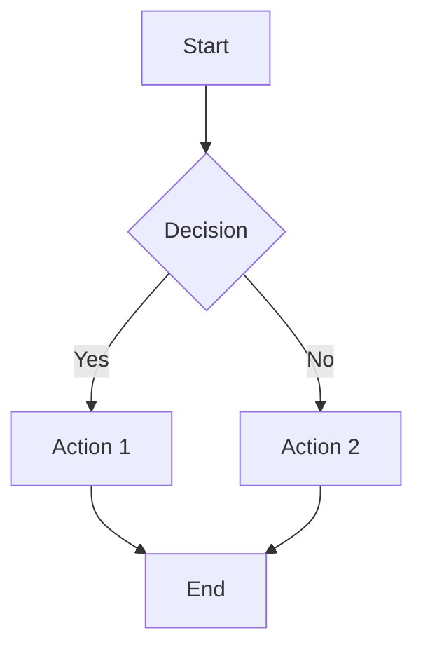
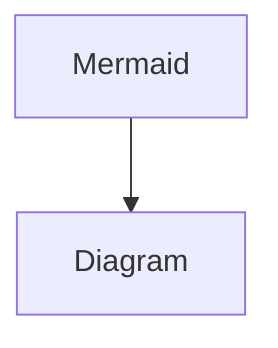

# Test mermaid


```mermaid
graph TD;
    A[Start] --> B{Decision};
    B -->|Yes| C[Action 1];
    B -->|No| D[Action 2];
    C --> E[End];
    D --> E;
```


```mermaid
graph TD
  Mermaid --> Diagram
```

```python
// Some code
```



